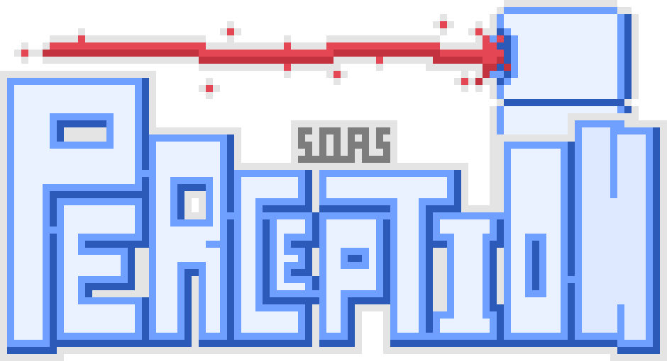

<h1 align="center">

</h1>

Overview
-----------------------------

Codebase for the Swarm on a Stick - Perception group.

Includes code for:

- deployment 
- unit testing 
- subsystem testing
- calibration

Prototyping code written in micropython for use with ESP32 microcontroller.

Supported hardware
------------------
- ToF Sensor
- Servo motor
- Hall Effect Encoder
- IR sensor
- Piezo buzzer
- Microphone
- 9-axis IMU
- Gesture Sensor
- OLED display
- Button